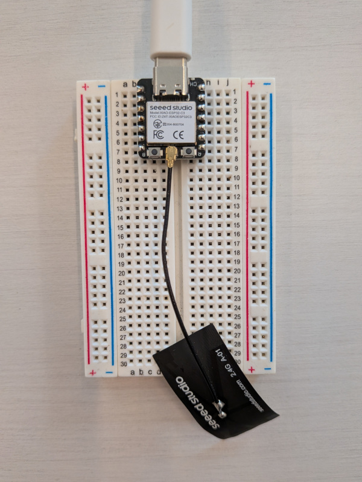
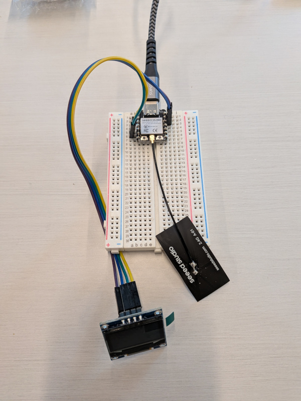

# Bluetooth Tutorial

This series of tutorials is intended to help you learn about programming for Bluetooth using TinyGo and the TinyGo [Bluetooth package](https://github.com/tinygo-org/bluetooth)

## What you need

    - Xiao-ESP32C3 board
    - SSD1306 display and cables
    - Personal computer with Go 1.25+ and TinyGo installed, and a serial port.

## Connecting the Seeed Studio Xiao ESP32-C3 to your computer


Plug the Seeed Studio Xiao ESP32-C3 into your computer using a USB cable. There may be one provided in your starter kit.

You should also attach the small antenna to the Xiao ESP32-C3 board uFL connector for best reception.

## Code

### step0.go - Hello, World



This tests that you can compile and flash your Xiao-ESP32C3 board with TinyGo code, by having it output "Hello, world" on your terminal.

Run the following command to compile your code, and flash it onto the Xiao-ESP32C3:

```
tinygo flash -target xiao-esp32c3 -monitor ./step0/
```

Once the Xiao-ESP32C3 is flashed correctly, you should see the message "Hello, World" displayed each second on your terminal and you are ready to continue.

### step1.go - Bluetooth scan

First run some code to scan your local area for Bluetooth devices. This program will use the Bluetooth interface in your Xiao-ESP32C3 and show the output from it on your computer terminal using the USB interface.

Run the code.

```shell
tinygo flash -target xiao-esp32c3 -monitor ./step1
```

You will see output on your terminal. Each of the devices list is a Bluetooth device nearby that is advertising itself.

```shell
Connected to /dev/ttyACM0. Press Ctrl-C to exit.
Starting BLE
scanning...
found device: 43:25:57:76:0B:01 -79 
found device: 5D:81:64:4E:D2:BD -87 
found device: F4:FD:9C:36:05:50 -51 SM-0550
found device: 79:09:B1:71:1F:8F -84
...
```

### step2.go - Bluetooth scan on OLED display



Next step is to scan for Bluetooth device as in the previous step, but displaying the output on the OLED display.

We will add a SSD1306 OLED display to show the results from the Bluetooth scan. We will control this display using an [I2C interface](https://en.wikipedia.org/wiki/I%C2%B2C).

- Connect a jumper wire from the "GND" pin on the breadboard next to the OLED display, to the breadboard's top left set of pins (-).

- Connect a jumper wire from the "VCC" pin on the breadboard next to the OLED display, to the breadboard's top right (+) set of pins.

- Connect a jumper wire from the "SDA" pin on the breadboard next to the OLED display, to the Xiao D4 pin.

- Connect a jumper wire from the "SCL" pin on the breadboard next to the OLED display, to the Xiao D5 pin.

We have 2 TinyGo packages to make it easier to use small displays such as the SSD1306 in the kit. 

The TinyFont package renders fonts to any of the supported displays in the TinyGo drivers repo. 

The TinyTerm package provides a terminal-style output on supported displays in the TinyGo drivers repo. 

Run the code.

```shell
tinygo flash -target xiao-esp32c3 -monitor ./step2
```

You will see the bluetooth scan output on both your monitor and on the SSD1306 display.


### step3.go - Bluetooth discover

Now that you know how to find Bluetooth devices that are nearby you, you can proceed to try to connect to one of them and find out what services it can offer.

You will need to use the MAC address (Linux or Windows) or the Bluetooth ID (macOS) to connect to a specific device.

Try one of of the devices you found when you were scanning in step1/step2.

Run the code.

Note that not all devices will allow you to connect to them, and that some that allow you to connect will not allow you to view the details of every service/characteristic.

```shell
tinygo flash -target xiao-esp32c3 -monitor -ldflags="-X main.DeviceName=[Bluetooth device name goes here]" ./step3
```

### step4.go - Bluetooth discover on xiao-esp32c3 display

This is the same Bluetooth service discovery as the previous example, but it also shows the data on the xiao-esp32c3 display.

Run the code.

```shell
tinygo flash -target xiao-esp32c3 -monitor -ldflags="-X main.DeviceName=[Bluetooth device name goes here]" ./step4
```

You should see the output on both your terminal, and also on the xiao-esp32c3 display.


### step5.go - Bluetooth heart rate monitor

Now that you know how to find Bluetooth devices that are nearby you and how to connect to them, you can proceed to try to do something useful.

Let's connect the xiao-esp32c3 to a Bluetooth heart rate sensor.

If you already have a smart watch or app on your phone that is a heart rate sensor, you can connect to it. Otherwise you can obtain one for your mobile device such as those listed here:

https://www.cnet.com/health/how-to-track-your-heart-rate-with-a-smartphone/

You can also run a simulator on your laptop computer:

```shell

go run ./heartsim
```

Run the code.

```shell
tinygo flash -target xiao-esp32c3 -monitor -ldflags="-X main.DeviceName=[Bluetooth device name goes here]" ./step5
```

You can connect from the xiao-esp32c3 to your mobile phone or any other device/software that can produce the data from a standard Bluetooth heart rate device.


### step6.go - Bluetooth heart rate monitor on xiao-esp32c3 display

This is the same heart rate device as the previous example, but it also shows the data on the xiao-esp32c3 display. You will still need to connect to your mobile phone or any other device/software that can produce the data for a standard Bluetooth heart rate device.

Run the code.

```shell
tinygo flash -target xiao-esp32c3 -monitor -ldflags="-X main.DeviceAddress=[MAC address or Bluetooth ID goes here]" ./step6
```

### step7.go - Bluetooth peripheral - advertising

Now it is time to flip this around. We will turn the Xiao-ESP32C3 into the actual heart rate sensor itself.

The first step is just to make the Xiao-ESP32C3 advertise that it is ready to have something connect.

Run this to flash the code onto the Xiao-ESP32C3. Make sure you change `yournamehere` to some short but unique name, so you do not get the device mixed up with someone else's device:

```shell
tinygo flash -target xiao-esp32c3 -ldflags="-X main.DeviceName='yournamehere'" ./step7
```

Once the code is running on the board, we can scan for it by running the code from step 1, but this time on your computer:

```shell
go run ./step1
```

Your terminal should output something like this:

```shell
$ go run ./step1/
scanning...
found device: 58:BF:25:3B:E2:3A -56 yournamehere
found device: 58:BF:25:3B:E2:3A -57 yournamehere
found device: 58:BF:25:3B:E2:3A -55 yournamehere
found device: 58:BF:25:3B:E2:3A -55 yournamehere
```

Hit "ctrl-C" on your keyboard to stop scanning.

### step8.go - Bluetooth peripheral - heart rate

We are now ready to start sending heart rate data fro the board.

Run this to flash the code onto the Xiao-ESP32C3. Remember to change `yournamehere` again:

```shell
tinygo flash -target xiao-esp32c3 -ldflags="-X main.DeviceName='yournamehere'" ./step8
```

Once the code is running on the board, you can connect to it from any application that can read the standard heart rate sensor profile.

First try by running the "heartmonitor" program on your computer. Replace the name (`MyHeartRateDevice`) with the name from your own device. If you are not sure what it is, remember you can run `go run ./step1` to scan for it!

```shell
go run ./heartmonitor/ "My Heart"
```

If you have a mobile application that can connect to heart rate sensors, it should work with your Xiao-ESP32C3 to display the data. Give it a try!
